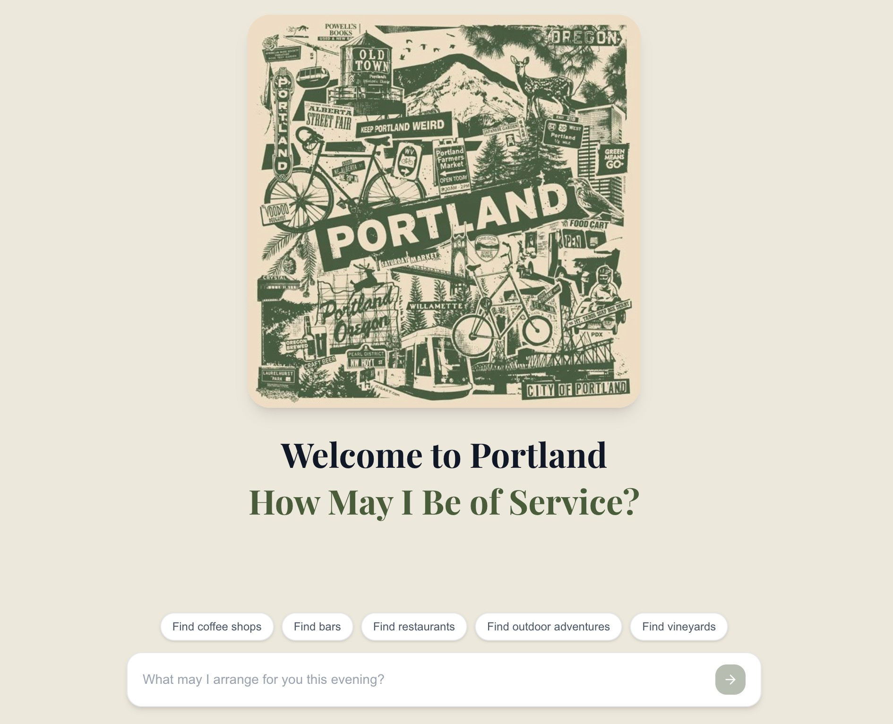
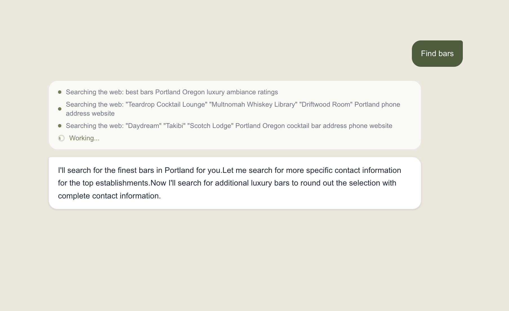
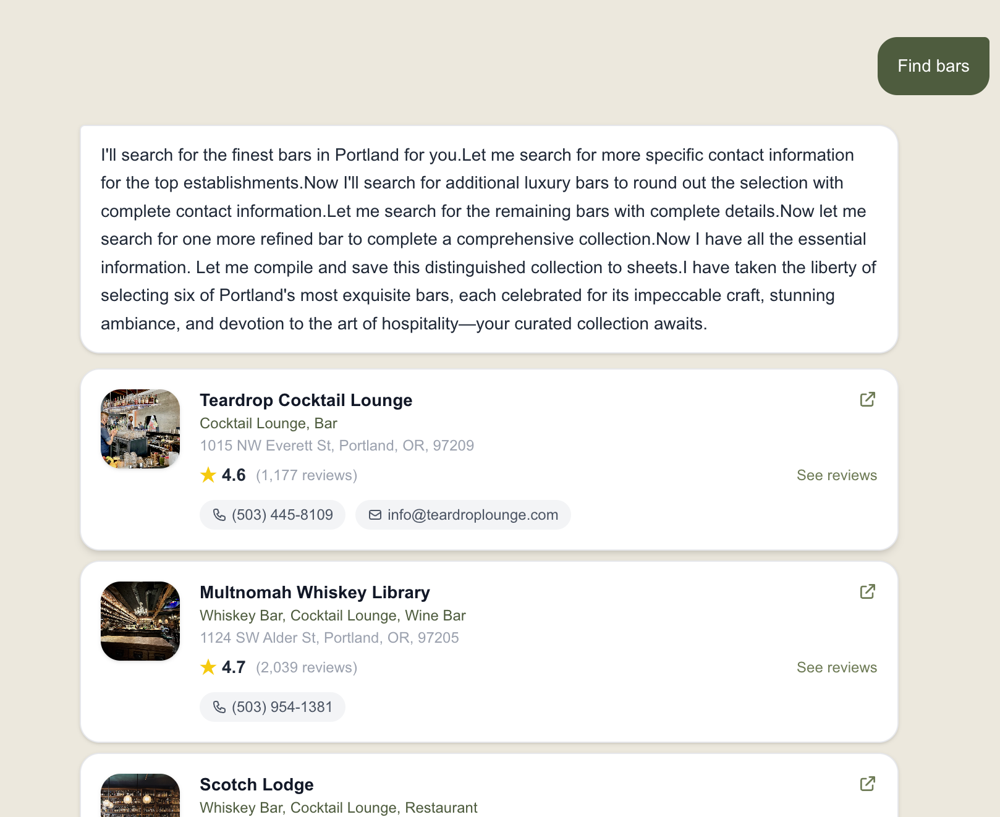
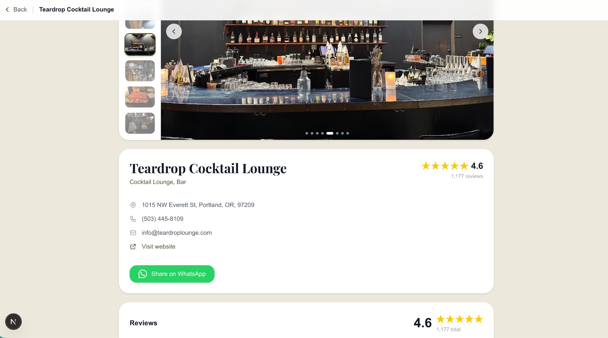

# Portland Concierge Agent

An AI-powered venue discovery app for Portland, OR. Ask for the finest bars, restaurants, coffee shops, vineyards, or outdoor experiences — the concierge curates a hand-picked list, pulls Google ratings and photos, and saves results to Google Sheets.

**Live:** [lead-crawler-ten.vercel.app](https://lead-crawler-ten.vercel.app)

---

## Screenshots

| Welcome | Search |
|---|---|
|  |  |

| Results | Detail page |
|---|---|
|  |  |

---

## Features

- **AI concierge** — Claude Haiku curates places with luxury-first criteria (4.5+ ratings, stunning ambiance)
- **Google Places integration** — live star ratings, review counts, and real photos
- **Photo carousel** — up to 8 photos per venue on the detail page
- **Google Reviews** — up to 5 reviews per venue
- **Google Sheets export** — every search auto-saves to a shared sheet
- **Email results** — send the curated list to any email via Resend
- **WhatsApp share** — share any venue with a direct Google Maps link
- **Session persistence** — chat history survives page navigation

## Tech Stack

- **Framework:** Next.js 14 (App Router)
- **AI:** Anthropic Claude Haiku via tool use + streaming SSE
- **Search:** Tavily API
- **Places & Photos:** Google Places API
- **Storage:** Google Sheets API (service account)
- **Email:** Resend
- **Styling:** Tailwind CSS + Playfair Display font
- **Deployment:** Vercel

## Environment Variables

```env
ANTHROPIC_API_KEY=
TAVILY_API_KEY=
GOOGLE_SHEET_ID=
GOOGLE_SERVICE_ACCOUNT_JSON=
GOOGLE_PLACES_API_KEY=
RESEND_API_KEY=
```
